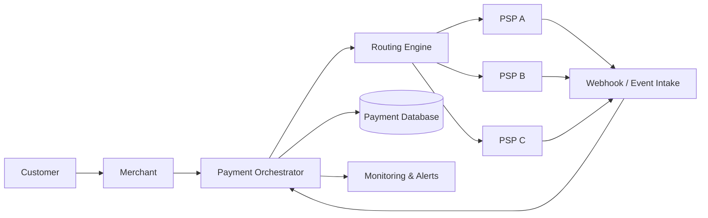

# Payment Orchestrator

### A business-first system design case study for reliable multi-PSP payments

> **Business question:** How would you design a payment platform that can work with multiple payment providers without making the merchant's revenue depend on a single provider?

This project explores that question from **business problem → solution strategy → system design → failure handling → reliability → operations**.

It is intentionally **documentation-first**. There is no production payment code here. The goal is to show how a complex FinTech problem can be turned into a practical, reliable architecture.

---

## Start here

If you are **not a software engineer**, read these first:

1. [The Business Problem](payment-orchestrator-case-study/01-business-problem.md)
2. [How the Solution Works](payment-orchestrator-case-study/02-how-the-solution-works.md)
3. [A Payment's Journey](payment-orchestrator-case-study/03-payment-journey.md)
4. [When Things Go Wrong](payment-orchestrator-case-study/04-when-things-go-wrong.md)
5. [Business Value](payment-orchestrator-case-study/05-business-value.md)
6. [Glossary](payment-orchestrator-case-study/glossary.md)

If you are an **engineer / architect**, continue into:

- [High-Level Design](payment-orchestrator-case-study/technical/HLD.md)
- [Low-Level Design](payment-orchestrator-case-study/technical/LLD.md)
- [Data Model](payment-orchestrator-case-study/technical/data-model.md)
- [Payment State Machine](payment-orchestrator-case-study/technical/state-machine.md)
- [API Design](payment-orchestrator-case-study/technical/API-design.md)
- [Reliability Strategy](payment-orchestrator-case-study/technical/reliability.md)
- [Security Strategy](payment-orchestrator-case-study/technical/security.md)
- [Observability](payment-orchestrator-case-study/technical/observability.md)
- [Trade-offs](payment-orchestrator-case-study/technical/trade-offs.md)
- [Decision Log](payment-orchestrator-case-study/technical/decision-log.md)
- [Interview Discussion](payment-orchestrator-case-study/technical/interview-discussion.md)

---

# 1. The problem in one minute

Imagine a merchant accepts online payments.

Today, the merchant may connect directly to one payment service provider (PSP).

That creates a problem:

```text
Customer
   |
   v
Merchant
   |
   v
One PSP
   |
   +---- PSP healthy ------> Payment succeeds
   |
   +---- PSP slow/down ----> Payment experience suffers
```

A larger merchant may want to use several PSPs.

But simply connecting three PSPs does not solve the problem.

The platform now needs to answer questions such as:

- Which PSP should receive this payment?
- What happens if the PSP times out?
- Can we safely try another PSP?
- What if the first PSP actually processed the payment but our system did not receive the response?
- What if the customer clicks Pay twice?
- What if the same webhook arrives twice?
- What if webhooks arrive out of order?
- How do we know the final state of a payment?
- How do operations teams investigate a payment that looks stuck?

The **Payment Orchestrator** is the system responsible for coordinating those decisions.

---

# 2. The idea in one picture



The orchestrator becomes the **control layer** between the merchant and payment providers.

---

# 3. Follow one ₹1,000 payment

Suppose a customer is buying something worth **₹1,000**.

### Step 1 — Customer clicks Pay

The merchant sends a payment request to the orchestrator.

### Step 2 — Orchestrator creates the payment

The system creates its own payment record and gives the request a unique identity.

### Step 3 — Routing decision

The routing engine evaluates the available PSPs.

For example:

```text
Payment
  |
  +-- Currency: INR
  +-- Method: UPI
  +-- Merchant: ABC
  +-- PSP health
  +-- Historical success
  +-- Current routing rules
           |
           v
       Select PSP A
```

### Step 4 — PSP processes the payment

The orchestrator sends the payment to the selected provider.

### Step 5 — Final result

There are several possibilities:

```text
SUCCESS
   |
   +--> Merchant can fulfil the order

FAILED
   |
   +--> Merchant can show payment failure

UNKNOWN
   |
   +--> Do NOT blindly charge again
   +--> Wait for provider confirmation / reconciliation
```

That third state is particularly important.

A timeout does **not** automatically mean that the payment failed.

---

# 4. The most important idea: UNKNOWN

Consider this sequence:

```text
Merchant
   |
   v
Orchestrator
   |
   v
PSP
   |
   | Payment processed successfully
   |
   X  Network timeout
   |
Orchestrator does not receive response
```

The orchestrator knows:

> "I did not receive the response."

It does **not** necessarily know:

> "The payment failed."

Therefore:

```text
UNKNOWN != FAILED
```

This distinction protects against accidental double charging.

A reliable payment architecture must treat uncertainty as a real system state.

---

# 5. What this architecture provides

| Capability | Business meaning |
|---|---|
| Multi-PSP connectivity | Merchant is not tied to one provider |
| Smart routing | Payments can be directed according to configured rules |
| Failover | Another provider can be considered when safe |
| Idempotency | Repeated requests do not create accidental duplicate payments |
| Webhook handling | Provider updates can be processed safely |
| State machine | Every payment has a controlled lifecycle |
| Reconciliation | Internal records can be compared with provider records |
| Monitoring | Teams can see payment health and failures |
| Audit trail | Important payment decisions can be investigated |

---

# 6. What happens when things go wrong?

This architecture is designed around failure, not only the happy path.

Examples:

- PSP timeout
- PSP outage
- Duplicate customer request
- Duplicate webhook
- Out-of-order webhook
- Database failure
- Message delivery failure
- Payment stuck in an intermediate state
- Provider says SUCCESS while the internal system says UNKNOWN

See the full walkthrough in [When Things Go Wrong](payment-orchestrator-case-study/04-when-things-go-wrong.md).

---

# 7. Business outcome

The orchestrator does not magically make every payment succeed.

Instead, it gives the business a **controlled way to manage payment complexity**.

It separates:

```text
Merchant business logic
        |
        v
Payment orchestration
        |
        +---- PSP A
        +---- PSP B
        +---- PSP C
```

That separation makes provider changes, routing decisions, failure handling and operational investigation much easier to manage.

---

# 8. Architecture layers

The design can be understood in four layers:

### Business layer

What problem are we solving?

→ [Business Problem](payment-orchestrator-case-study/01-business-problem.md)

### Solution layer

What should the platform do?

→ [How the Solution Works](payment-orchestrator-case-study/02-how-the-solution-works.md)

### Architecture layer

How are the components connected?

→ [High-Level Design](payment-orchestrator-case-study/technical/HLD.md)

### Engineering layer

How exactly do state, data, APIs, retries and failures work?

→ [Technical Deep Dive](payment-orchestrator-case-study/technical/LLD.md)

---

# 9. Project scope

This is an **architecture and system-design case study**.

It demonstrates:

- Business requirements
- Solution strategy
- HLD
- LLD
- Data modelling
- Payment state management
- API design
- Reliability
- Security
- Observability
- Scaling
- Trade-offs
- Architecture decisions

It does **not** claim to process real payments or represent a production deployment.

---

## Explore the project

### For everyone

- [Business Problem](payment-orchestrator-case-study/01-business-problem.md)
- [How the Solution Works](payment-orchestrator-case-study/02-how-the-solution-works.md)
- [Payment Journey](payment-orchestrator-case-study/03-payment-journey.md)
- [Failure Scenarios](payment-orchestrator-case-study/04-when-things-go-wrong.md)
- [Business Value](payment-orchestrator-case-study/05-business-value.md)
- [Glossary](payment-orchestrator-case-study/glossary.md)

### For engineers

- [HLD](payment-orchestrator-case-study/technical/HLD.md)
- [LLD](payment-orchestrator-case-study/technical/LLD.md)
- [Data Model](payment-orchestrator-case-study/technical/data-model.md)
- [State Machine](payment-orchestrator-case-study/technical/state-machine.md)
- [API Design](payment-orchestrator-case-study/technical/API-design.md)
- [Reliability](payment-orchestrator-case-study/technical/reliability.md)
- [Security](payment-orchestrator-case-study/technical/security.md)
- [Observability](payment-orchestrator-case-study/technical/observability.md)
- [Trade-offs](payment-orchestrator-case-study/technical/trade-offs.md)
- [Decision Log](payment-orchestrator-case-study/technical/decision-log.md)
- [Interview Discussion](payment-orchestrator-case-study/technical/interview-discussion.md)

---

## The design journey

```text
Business Problem
      ↓
Requirements
      ↓
Solution Strategy
      ↓
Architecture
      ↓
Payment Flows
      ↓
Failure Handling
      ↓
Reliability
      ↓
Security & Observability
      ↓
Trade-offs
```

**Next:** [The Business Problem →](payment-orchestrator-case-study/01-business-problem.md)
