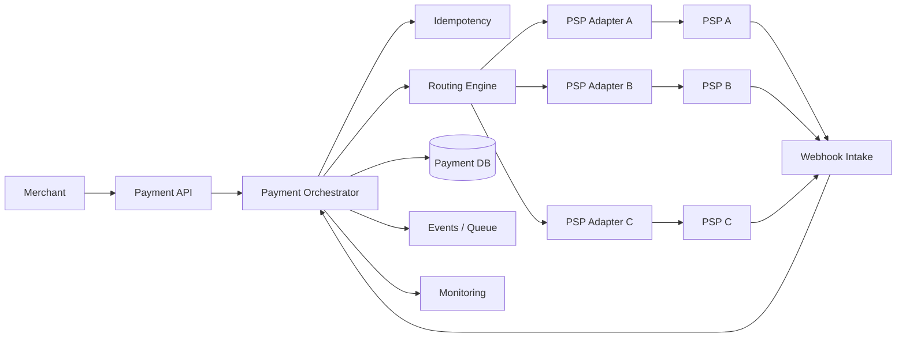
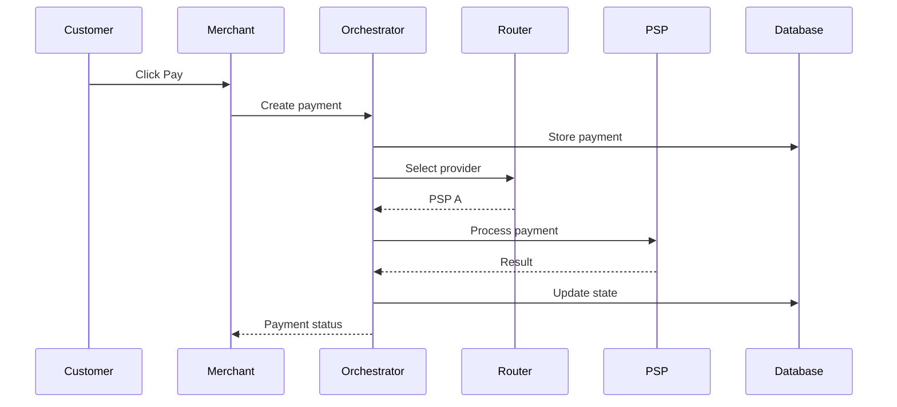

# 02 — How the Solution Works

## In one sentence

The Payment Orchestrator sits between the merchant and PSPs and manages the payment lifecycle from request to final outcome.

---

# The big picture



---

# Think of the orchestrator as a traffic controller

A traffic controller does not build the roads or manufacture the cars.

The controller coordinates movement.

The payment orchestrator works similarly.

The PSPs perform payment processing.

The orchestrator coordinates:

- Where a payment should go
- What state it is in
- What to do when a provider fails
- How to handle provider notifications
- How to prevent duplicate processing

---

# Main components

## 1. Payment API

### What it does

Receives payment requests from the merchant.

### Why it exists

The merchant should interact with one consistent interface rather than learning every PSP's API.

---

## 2. Idempotency layer

### What it does

Detects repeated payment requests with the same idempotency key.

### Why it exists

Customers can double-click, browsers can retry requests, and networks can repeat requests.

The platform must avoid treating every repeat as a new payment.

---

## 3. Routing engine

### What it does

Chooses an eligible PSP.

Possible inputs include:

- Payment method
- Currency
- Merchant configuration
- Country
- PSP availability
- Routing rules
- Provider health

### Why it exists

Provider selection becomes a platform capability rather than merchant-specific logic.

---

## 4. PSP adapters

Each provider can expose a different API.

The adapter converts between:

```text
Orchestrator's canonical model
            ↕
Provider-specific model
```

This keeps provider-specific details isolated.

---

## 5. Payment state manager

The payment lifecycle is controlled by explicit states.

For example:

```text
CREATED
   ↓
PROCESSING
   ↓
SUCCESS
```

or:

```text
CREATED
   ↓
PROCESSING
   ↓
UNKNOWN
   ↓
RECONCILED
```

The system should not allow arbitrary state changes.

---

## 6. Webhook intake

PSPs may notify the orchestrator later.

Example:

```text
PSP
 |
 | payment.completed
 v
Webhook endpoint
 |
 v
Validate → Deduplicate → Apply state transition
```

---

## 7. Payment database

Stores the platform's source of truth for:

- Payment
- Attempts
- Provider references
- State
- Idempotency
- Webhook processing
- Audit information

---

## 8. Observability

Provides:

- Metrics
- Logs
- Traces
- Alerts
- Operational dashboards

This answers:

> "What is happening to payments right now?"

---

# One payment through the system



---

# Why this architecture is useful

Without an orchestrator:

```text
Merchant
 ├── PSP A logic
 ├── PSP B logic
 ├── PSP C logic
 ├── retry logic
 ├── webhook logic
 └── reconciliation logic
```

With an orchestrator:

```text
Merchant
    |
    v
Orchestrator
    |
    +── PSP A
    +── PSP B
    +── PSP C
```

The complexity is concentrated in one platform capability.

---

# Design principle

> **Keep merchant-facing payment behaviour stable while allowing provider-specific implementation to change behind the orchestrator.**

**Next:** [A Payment's Journey →](03-payment-journey.md)

[Back to README](README.md)
