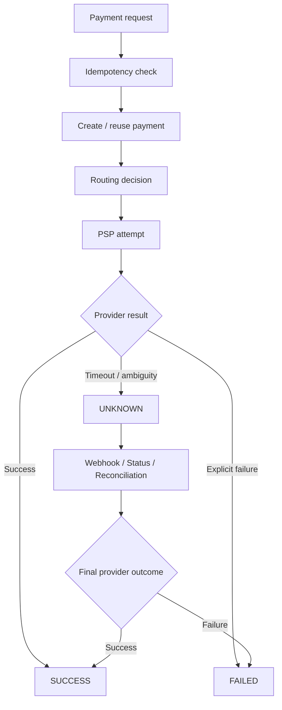

# 03 — A Payment's Journey

## In one sentence

This document follows one ₹1,000 payment through the system, including success, timeout, duplicate request and webhook scenarios.

---

# Scenario

A customer is purchasing an item for:

**₹1,000**

The merchant wants to charge the customer.

---

# Happy path

```text
Customer
   |
   | Pay ₹1,000
   v
Merchant
   |
   | Create Payment
   v
Orchestrator
   |
   | Choose PSP
   v
PSP A
   |
   | SUCCESS
   v
Orchestrator
   |
   v
Merchant
   |
   v
Order fulfilled
```

---

# Step-by-step

## 1. Merchant creates the payment

The merchant sends:

```text
amount = ₹1,000
currency = INR
payment_method = UPI
idempotency_key = unique-request-key
```

The orchestrator creates an internal payment ID.

Example:

```text
payment_id = pay_12345
```

---

## 2. Idempotency is checked

Suppose the merchant accidentally sends the same request again.

The system checks:

```text
idempotency_key
```

If the request has already been processed, the existing payment result can be returned rather than creating another payment.

---

# 3. The router selects a PSP

The routing engine considers the configured rules.

Conceptually:

```text
Payment
   |
   +-- Currency
   +-- Method
   +-- Merchant
   +-- Provider eligibility
   +-- Provider health
   |
   v
Selected PSP
```

The routing engine does not need to expose provider-specific details to the merchant.

---

# 4. PSP processing

The orchestrator calls the provider through its adapter.

```text
Orchestrator
      |
      v
PSP Adapter
      |
      v
PSP API
```

The adapter converts the canonical payment request into the provider's format.

---

# 5. Success

If the provider confirms success:

```text
PROCESSING → SUCCESS
```

The merchant can proceed with its order workflow.

---

# Scenario B — PSP timeout

Now consider:

```text
Orchestrator → PSP
                |
                | Payment processed
                |
                X Response lost
```

The orchestrator experiences a timeout.

It must not automatically assume:

```text
TIMEOUT = FAILED
```

Instead:

```text
PROCESSING → UNKNOWN
```

The system can then use:

- Provider webhook
- Provider status query
- Reconciliation
- Operational investigation

to determine the final outcome.

---

# Scenario C — Customer clicks Pay twice

```text
Request A
   |
   v
Idempotency key = abc123

Request B
   |
   v
Idempotency key = abc123
```

The second request should resolve to the same logical payment.

The key idea:

```text
Same business operation
        +
Same idempotency key
        =
Same payment identity
```

---

# Scenario D — Webhook arrives later

Suppose the payment is initially UNKNOWN.

Later:

```text
PSP → Webhook → Orchestrator
```

The orchestrator:

1. Verifies the webhook
2. Identifies the payment
3. Checks whether the event was already processed
4. Validates the state transition
5. Updates the payment
6. Records the event

Example:

```text
UNKNOWN
   |
   | verified provider event
   v
SUCCESS
```

---

# Scenario E — Webhook arrives twice

Provider systems may retry notifications.

Therefore:

```text
Webhook #1 → process
Webhook #2 → recognise duplicate → do not apply twice
```

Webhook idempotency is separate from payment-request idempotency.

---

# Scenario F — Webhooks arrive out of order

Suppose events arrive:

```text
SUCCESS
then
PROCESSING
```

The state machine should prevent an invalid transition such as:

```text
SUCCESS → PROCESSING
```

This is why the state machine matters.

---

# Complete journey



---

# The important mental model

A payment is not simply:

```text
SUCCESS / FAILED
```

A robust system models the lifecycle explicitly.

That gives the business a safer answer to:

> "What do we actually know about this payment?"

**Next:** [When Things Go Wrong →](04-when-things-go-wrong.md)

[Back to README](README.md)
