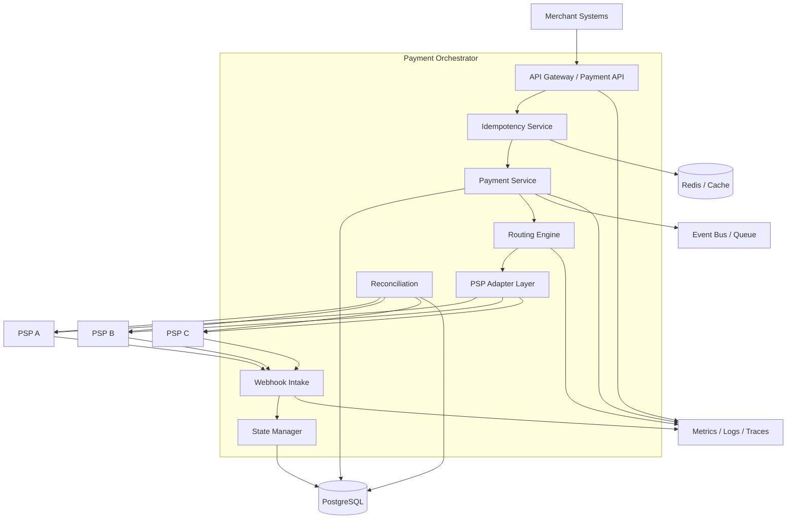

# Technical — High-Level Design

## Purpose

Define the major components, boundaries and data flows of the Payment Orchestrator.

---

## Architecture



---

# Component responsibilities

| Component | Responsibility |
|---|---|
| Payment API | Merchant-facing payment interface |
| Idempotency | Prevent duplicate logical operations |
| Payment Service | Own payment lifecycle orchestration |
| Routing Engine | Select eligible PSP |
| Adapter Layer | Isolate provider-specific APIs |
| State Manager | Validate and apply state transitions |
| Webhook Intake | Receive asynchronous provider events |
| Reconciliation | Compare internal and provider states |
| Database | Durable source of payment records |
| Cache | Fast lookup / short-lived coordination where appropriate |
| Queue | Asynchronous event delivery |
| Observability | Metrics, logs and traces |

---

# Primary synchronous flow

```text
Merchant
  ↓
Payment API
  ↓
Idempotency
  ↓
Payment Service
  ↓
Routing
  ↓
PSP Adapter
  ↓
PSP
  ↓
Result
  ↓
State update
  ↓
Merchant response
```

---

# Asynchronous flow

```text
PSP
  ↓
Webhook
  ↓
Authentication / signature validation
  ↓
Event deduplication
  ↓
Payment lookup
  ↓
State transition validation
  ↓
Database update
  ↓
Internal event
```

---

# Scaling boundaries

The most naturally scalable components are:

- API instances
- Payment service instances
- Routing workers
- Webhook workers
- Reconciliation workers

The database remains a critical shared dependency and therefore requires deliberate capacity planning, indexing, partitioning strategy where needed, connection-pool control and operational safeguards.

---

# Architecture principle

Keep provider-specific behaviour at the edge:

```text
Canonical Payment Model
          |
          v
     Adapter Layer
       /   |   \
    PSP A PSP B PSP C
```

This prevents provider-specific concepts from spreading through the core domain.

[Back to README](../README.md)
