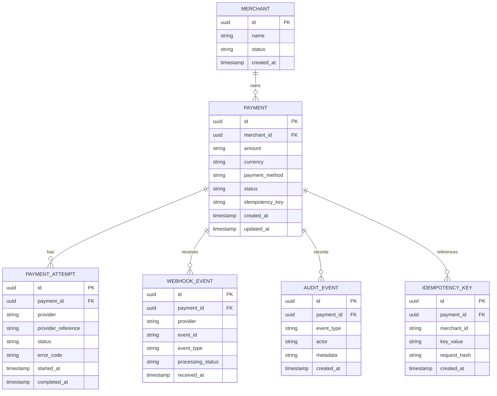

# Technical — Data Model

## Core entities



---

# Payment table

The payment represents the **business-level payment operation**.

Important fields:

```text
payment_id
merchant_id
amount
currency
payment_method
status
idempotency_key
created_at
updated_at
```

---

# Attempt table

An attempt represents interaction with a specific PSP.

This distinction is important.

```text
Payment
  |
  +-- PSP A attempt
  +-- PSP B attempt
```

The payment may have one or multiple attempts while still representing one logical customer payment.

---

# Webhook event table

Used for:

- Deduplication
- Audit
- Operational investigation
- Reprocessing controls

A provider event identifier should be uniquely constrained within the relevant provider scope.

---

# Idempotency constraints

Conceptually:

```text
UNIQUE(merchant_id, key_value)
```

A request hash can be stored to detect the same key being reused for a different request.

---

# Audit events

Audit records should answer:

> Who/what changed the payment, when, and why?

Examples:

```text
PAYMENT_CREATED
ROUTING_SELECTED
ATTEMPT_CREATED
STATE_CHANGED
WEBHOOK_RECEIVED
RECONCILIATION_UPDATED
```

[Back to README](../README.md)
